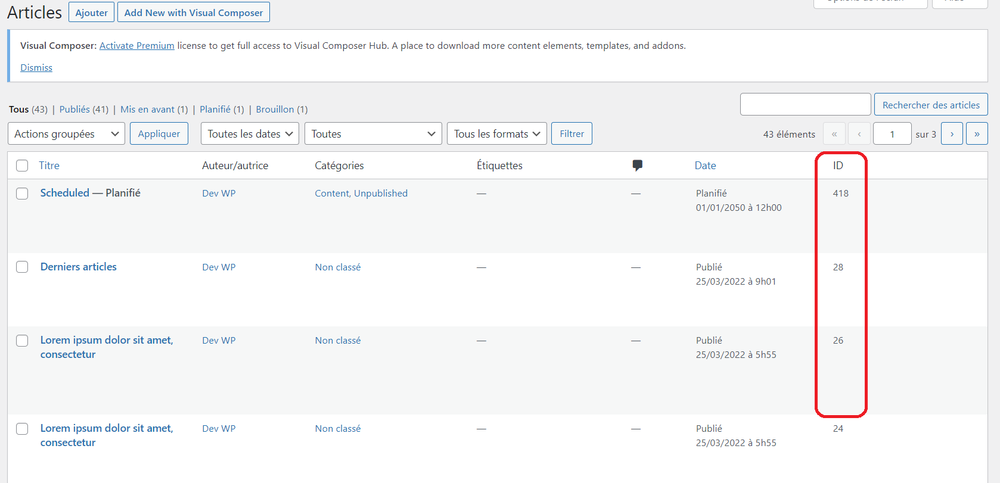
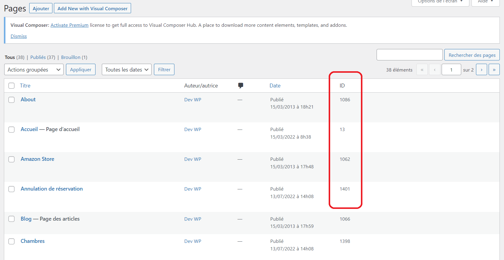

# Add-ID-Column

Gagner du temps ! Installer puis Activer cette extension et vous récupérerez facilement l'ID d'un article ou d'une page que vous voulez !

Ajoutez une colonne d'ID facilement identifiable à vos pages et articles avec notre plugin. 

L'ID d'un article ou d'une page est souvent utilisé dans les shortcodes et autres fonctionnalités de WordPress. 

Grâce à notre plugin, vous pouvez désormais voir rapidement et facilement l'ID de chaque page et article de votre site. 

Cette colonne vous sera utile pour personnaliser votre site et ajouter des fonctionnalités supplémentaires grâce aux shortcodes et aux autres outils de WordPress.

# Installation 
À PARTIR DE WORDPRESS

1. Allez dans 'Extensions > Ajouter'.
2. Recherchez 'Ajouter une colonne d'ID'.
3. Activez 'Ajouter une colonne d'ID' pour WordPress à partir du menu 'Extensions' de WordPress.
4. Allez dans Articles ou Pages, et récupérez l'ID d'un Article ou Page que vous voulez très facilement.

MANUELLEMENT

1. Téléchargez le dossier benawp-add-id-column/ dans le répertoire /wp-content/plugins/.
2. Activez le plugin dans le menu "Extensions" de WordPress.
3. Allez dans Articles ou Pages, et récupérez l'ID d'un Article ou Page que vous voulez très facilement.

# Utilisation

Puis allez dans le Back Office. Cliquez sur Articles ou Pages, et vous verrez un nouveau colonne nommé ID au niveau de votre listes d'Articles ou Pages, comme illustré les screenshots.

# Articles

# Pages

